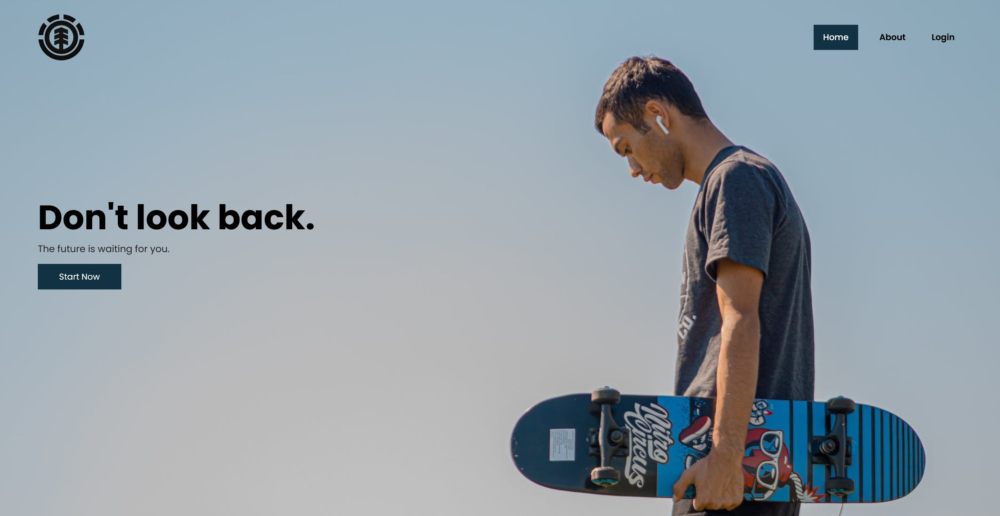

# Skateboard Landing Page

This is a **Skateboard Landing Page** that provides a clean and modern showcase of skateboard models, along with some simple promotional sections. It’s a static landing page built using just **HTML** and **CSS**.



## Features

-   **Hero Section**: A large banner image with a call-to-action.
-   **Learn New Things**: A section promoting skateboard activities and education.
-   **Pricing Plan Section**: Displays different skateboarding plans for beginners, intermediate, advanced, and pro levels.
-   **Product Showcase**: A section featuring five skateboard designs, with a "Buy Now" button for users to take action.
-   **Responsive Design**: The page is responsive and adapts well to different screen sizes.

## Tech Stack

-   **HTML5**: Structure of the web page.
-   **CSS3**: For styling and creating a responsive design.

## Getting Started

### Prerequisites

This is a static website. You only need a web browser to open and view the site.

### Installation

1. Clone the repository:

    ```bash
    git clone https://github.com/yourusername/skateboard-landing-page.git
    ```

2. Navigate to the project directory:

    ```bash
    cd skateboard-landing-page
    ```

3. Open `index.html` in your preferred web browser.

### Project Structure

```bash
├── index.html
├── css/
│   └── styles.css
└── img/(any images you used on the page)
```

-   **index.html**: The main HTML file for the landing page.
-   **css/styles.css**: The main CSS file for all page styling and responsiveness.
-   **/img/**: Directory for images used on the landing page.

## Contact

Feel free to reach out if you have any questions or would like to collaborate:

-   **Email**: arzoladeveloper@gmail.com
-   **LinkedIn**: [Your LinkedIn](https://www.linkedin.com/in/luis-arzola/)
-   **GitHub**: [Your GitHub](https://github.com/ArzolaG)
